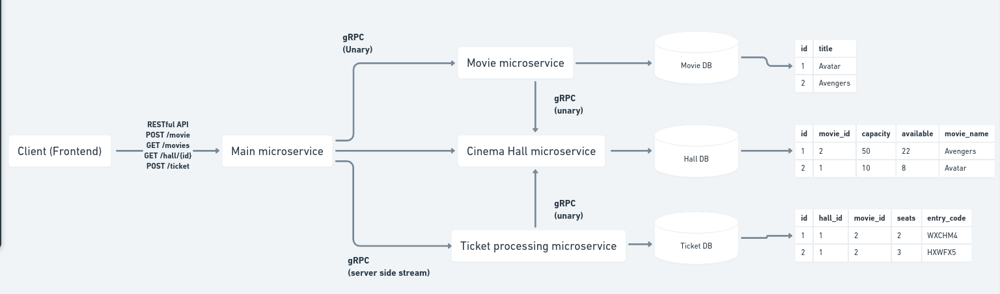

# Movie theatre application

_A microservice based backend to replicating a simple movie theatre backend_

---

## Architecture

## Tech Stack

1. FE - next js
2. main microservice - golang
3. movie microservice - js
4. cinema hall microservice - python
5. ticket microservice - golang
